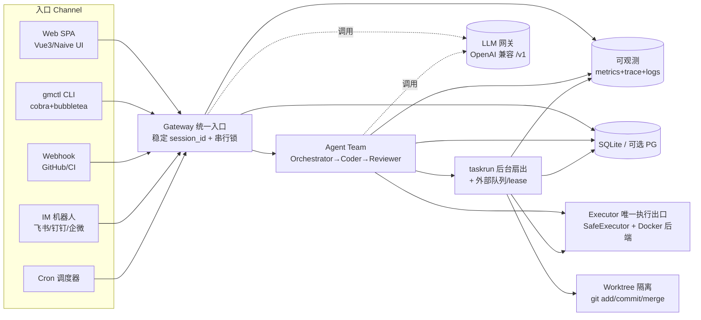
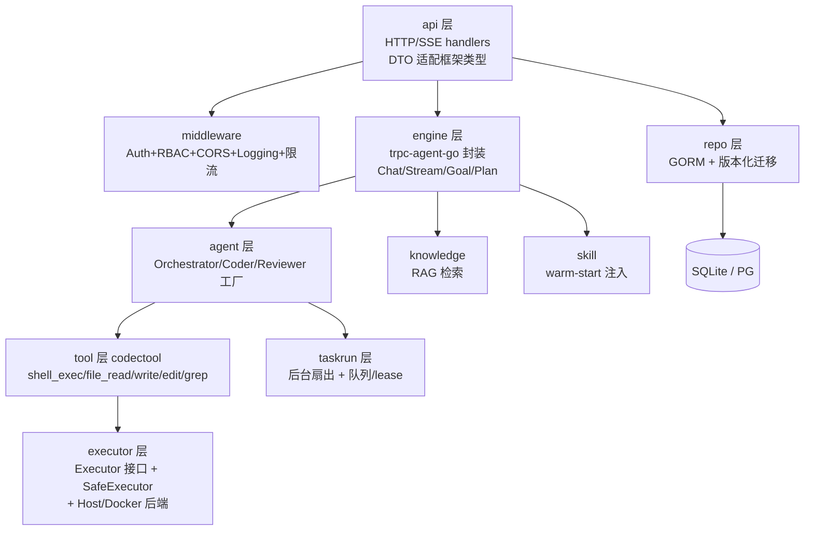
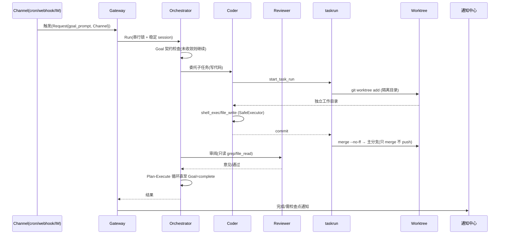
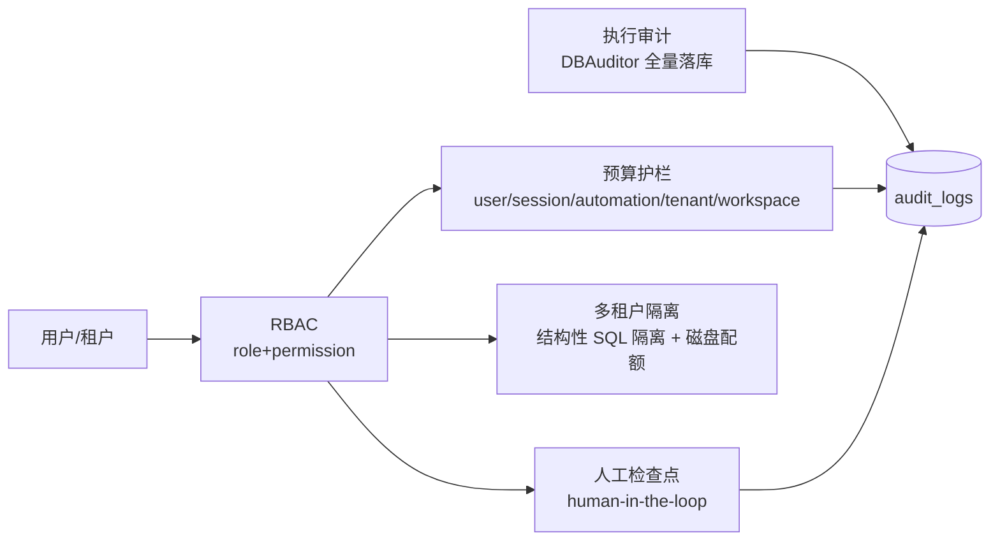
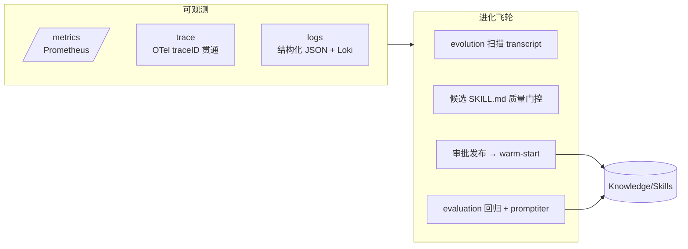
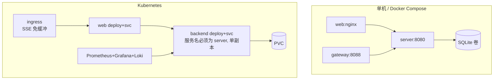

# goMultiAgentV2 系统架构

> 本文档给出企业级多 Agent 协作 CodeAgent 平台的完整架构视图，对标 OpenClaw + Claude 的 24h 无人值守自主工作模式。配合 [README.md](./README.md) 与 [docs/DEPLOYMENT.md](./docs/DEPLOYMENT.md) 使用。

---

## 1. 总览：三层组件

平台由「前端 Web」「后端 Server」「本地/外部 LLM 网关」三层构成，Agent 引擎基于 `trpc-agent-go v1.10.0`（仅用其 Agent 引擎层，且**业务代码只经 `internal/engine` 封装层**，框架锁版本，禁止绕过）。

| 组件 | 技术 | 默认端口 | 作用 |
|------|------|----------|------|
| Web | Vue3 + TS + Vite + Pinia + Naive UI | 开发 5173 / 生产 nginx | 管理后台、对话工作台、自动化、监控 |
| Server | Go 1.25 + Gin + GORM + 纯 Go SQLite（`glebarez/sqlite`，**无需 CGO**） | 8080 | 鉴权·RBAC·Agent 引擎·工具·执行器·Repo·自动化·可观测 |
| Gateway | WorkBuddy/CodeBuddy CLI 包装为 OpenAI 兼容 API | 8088 | 把本机积分或任意 OpenAI 兼容端点归一为标准 `/v1` |
| CLI | `gmctl`（独立 Go 模块） | — | 无界面环境复用同一 REST+SSE 协议 |

---

## 2. 后端分层架构

业务代码严格分层，**所有代码执行必须经 `internal/executor.Executor`，禁止散写 `os/exec`**；框架 `trpc-agent-go` 只在 `internal/engine` 层被调用。

**关键安全约定（详见 `docs/loop/LEARNINGS.md`）**：

- `Executor.Run` / `RunCommand` 是**唯一**执行出口；`SafeExecutor` 叠加危险命令策略（无人值守默认 `deny` + 写审计）。
- 文件类工具一律经 `resolveSafePath` 做路径越界校验。
- `EXECUTOR_BACKEND=host|docker` 可切换：Docker 后端提供只读根 + 网络白名单 + 目录隔离的真·文件系统沙箱（平台自身 git 基础设施保持 Host）。

---

## 3. 自主 Loop 运行流（24h 无人值守核心）

外部触发（定时/Webhook/IM）或跨天恢复，统一经 `Gateway` 进入同一 `Runner`，以「目标契约 Team」推进到 `complete/blocked` 才停。

**护栏（避免失控）**：`MAX_LLM_CALLS` / `MAX_TOOL_ITERATIONS` 熔断；预算超限暂停后续 LLM 调用；危险命令进 `checkpoints` 人工审批队列；无人值守模式强制 `deny` 语义命令。

---

## 4. 企业化控制平面

- **多租户**：`tenants` 表 + `users.tenant_id`；用量按 `user_id IN (SELECT id FROM users WHERE tenant_id=?)` 结构性隔离，租户 A 超限不影响 B；workspace 级磁盘配额（`ErrDiskQuotaExceeded` 写入前拒写）。
- **预算作用域**：`user` / `session` / `automation` / `tenant` / `workspace` 五级，聚合统计口径与用量记录同源（`usage_records`）。
- **连接器市场**：预置 GitHub/GitLab/Slack/Jira/Postgres/Redis/Filesystem/Fetch 等 MCP 模板，`{{KEY}}` 占位符一键导入加密落库。

---

## 5. 可观测性与进化飞轮

- **可观测**：`METRICS_ENABLED` 暴露 `/metrics`（LLM/工具调用数·时延·错误率·token）；`traceID` 贯通 Gateway→Runner→工具调用；结构化 JSON 日志便于 Loki 按 trace 串联。
- **进化飞轮**：后台扫描已结束 session → 提取候选技能 → 质量门控 → 审批发布 → 新会话 warm-start 命中；新技能自动进评估集，回归不过则阻止发布。

---

## 6. 部署拓扑

- **Docker Compose**：三服务一键编排（`docker-compose.yml`），适合演示与中小团队。
- **Kubernetes**：`k8s/` 提供 configmap/secret/pvc/backend+web deploy/svc/ingress/hpa；**backend 固定 1 副本**（SQLite 单文件硬约束），要横向扩多副本须先切 PG（见 PLAN M8-10 条件触发）。
- 监控告警：`monitoring/` 提供 Prometheus + Alertmanager（六类规则）+ Grafana + Loki/Promtail。

详见 [docs/DEPLOYMENT.md](./docs/DEPLOYMENT.md) 与 [docs/loop/PLAN.md](./docs/loop/PLAN.md)。
