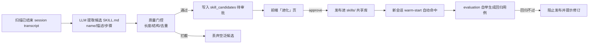

# 示例：技能进化飞轮（后台自动）

场景 C（见 [docs/DEMO-24H.md](../docs/DEMO-24H.md) 第 6 节）：平台后台定时扫描已结束 session 的 transcript，提取候选 `SKILL.md`，经质量门控后进入「进化」页待审批，审批发布即进入 `skills/` 共享库并被新会话 warm-start 命中——形成「越用越聪明」的飞轮。

该能力**无需手动创建自动化**，由后端环境变量控制：

---

## 1. 开启进化扫描

`server` 配置（`.env` 或容器环境变量）：

```sh
EVOLUTION_ENABLED=true            # 默认 true
EVOLUTION_INTERVAL_SECONDS=3600  # 扫描周期（秒），默认 3600
```

重启 server 后，后台 goroutine 按周期扫描「已结束 session」，流程：



---

## 2. 审批发布（前端或 API）

前端「进化」页查看候选 → 预览 → 审批（approve 发布为托管技能；reject 丢弃）。
审批后该技能进入 `skills/` 共享库，新会话按 workspace / 关键词 warm-start 注入 system 上下文（受 `SKILL_WARM_START_MAX_CHARS=6000` 控长）。

---

## 3. 配套能力（自动联动）

- **评估集自举**（`M8-05`）：新发布技能自动反向生成 eval 用例（保底知识 + 标题 + 命令多类），回归分数可比（Report 附历史基线与 delta）。
- **飞轮 × 回归联动**（`M5-08`）：新技能自动进 eval 集；回归不过则阻止发布。

---

## 4. 验证清单

- [ ] `EVOLUTION_ENABLED=true` 重启后，跑完一个典型任务
- [ ] 「进化」页出现至少一条候选（质量门控拦截空泛候选）
- [ ] 审批一条 → `skills/` 下出现新 `SKILL.md`
- [ ] 新建会话，system 上下文含该技能（warm-start 命中）
- [ ] 评估集自动新增对应用例，跑回归分数可比
